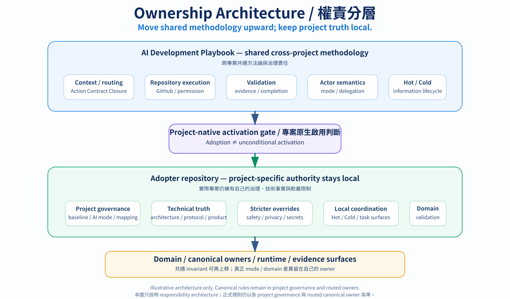
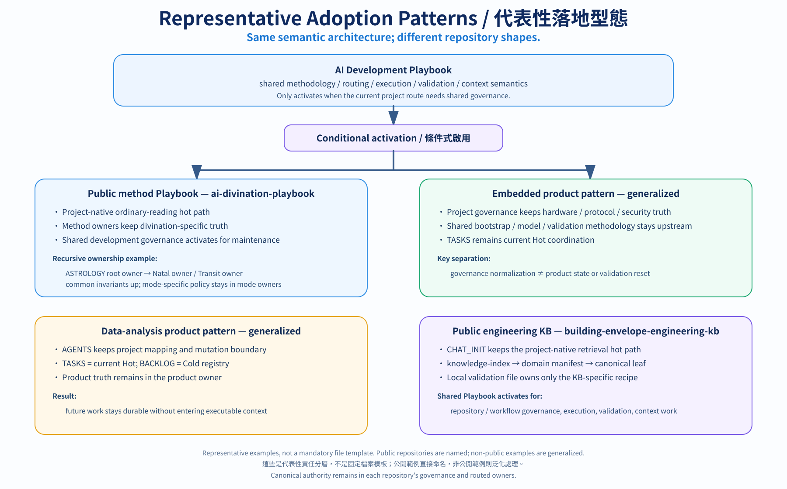

# AI Development Playbook｜AI 協作開發實戰手冊

> **Give AI enough structure to work reliably without turning engineering into bureaucracy.**
>
> **給 AI 足夠的結構，讓它可靠工作，但不要讓工程因此陷入繁瑣、僵化又低效的流程。**

## What this is / 這是什麼

**English**

AI Development Playbook is a reusable **GitHub-native governance and information-integrity layer** for ChatGPT, Codex, and other AI engineering workflows.

It helps long-lived repositories keep **current authority, durable memory, task admission, execution, validation, evidence, and context cost** separate instead of letting old chats, tool availability, or convenient summaries silently become project truth.

An adopting repository chooses one of two Project AI modes:

- `ChatGPT-Only`
- `ChatGPT+Codex`

These modes describe **AI actor topology**. They are not ChatGPT subscription tiers, model tiers, quotas, or fixed capability levels. Project governance still decides the actual path/action authority inside the selected mode.

Adoption also does **not** mean every task must load the shared Playbook. A project may keep ordinary tasks on its own project-native bootstrap/task-router path and activate the shared Playbook only when the current task actually needs common workflow governance.

`ChatGPT-Only` is designed to keep unnecessary ChatGPT capability requirements low. The preferred compatibility/regression target is documented in the dedicated **ChatGPT cold start** section below.

**繁體中文**

AI Development Playbook 是一套可重用、**以 GitHub 為核心的 AI 工程治理與資訊完整性層**，適用於 ChatGPT、Codex 與其他 AI 工程工作流程。

它的目的，是讓長期演進的儲存庫能持續區分**目前的權威來源、持久化記憶、任務納入、執行、驗證、證據與 Context 成本**，避免舊聊天室、工具可用性或方便閱讀的摘要悄悄被當成專案事實來源。

採用本手冊的儲存庫只選兩種 Project AI mode 之一：

- `ChatGPT-Only`
- `ChatGPT+Codex`

這兩種 mode 描述的是 **AI 角色配置（actor topology）**，不是 ChatGPT 訂閱方案、模型等級、使用額度或固定能力層級；實際的路徑／操作權限仍由專案治理規則決定。

採用本手冊也**不代表每個任務都要載入共用 Playbook**。專案可以讓一般任務維持自己的 project-native bootstrap／task-router hot path，只有本次工作真正需要共通工作流程治理時才啟用 Playbook。

對 `ChatGPT-Only`，核心設計會盡量降低不必要的 ChatGPT 能力需求；偏好的相容性／迴歸測試目標見下方獨立的 **ChatGPT 冷啟動** 章節。

> **Human-facing contract / 人類閱讀契約**：This README is the repository's primary human-facing surface. Normative rules remain in the linked canonical owners.／本 README 是此儲存庫的主要人類閱讀介面；正式規則仍以下方連結的 canonical owner 為準。

## Core mental model / 核心心智模型

**English**

The Playbook is built around a few deliberately separate ideas:

- **Persistence ≠ loading ≠ write ≠ execution authority.** Stored or visible information does not automatically belong in every task and does not grant mutation authority.
- **Current canonical state outranks historical memory.** Old chat, summaries, caches, handoffs, and external memory are evidence until reconciled with current authority.
- **Capability ≠ authority.** A tool being callable does not mean the current task is authorized to use it for mutation or scope expansion.
- **PASS ≠ done.** A passing test, workflow, or sub-check proves only its own scope; hardware, production, repository read-back, release, or deployment gates may remain separate.
- **Adoption ≠ unconditional activation.** Shared governance should be loaded only when the current project route says it is needed.
- **Use the lowest sufficient path.** Evidence, Context, model/reasoning, actor, runtime capability, and validation should expand only when the current level is insufficient.

**繁體中文**

Playbook 的核心刻意把幾個概念分開：

- **持久化 ≠ 載入 ≠ 寫入 ≠ 執行權限**：資訊被保存、看得到，不代表每個任務都要讀，也不代表因此取得修改權限。
- **目前 canonical state 優先於 historical memory**：舊聊天、摘要、cache、handoff 與外部 memory 都只能視為 evidence，必須先與 current authority 核對整合。
- **Capability ≠ authority**：工具能呼叫，不代表本次任務就有權修改內容或擴大工作範圍。
- **PASS ≠ done**：測試、工作流程或子檢查 PASS，只證明其實際涵蓋的範圍；硬體、production、repository read-back、release、deployment 等 gate 仍可能獨立存在。
- **採用 ≠ 無條件啟用**：只有專案路由判定需要時，才載入共用治理規則。
- **優先最低充分路徑**：證據、Context、模型／推理、執行角色、runtime capability 與驗證，都只有在目前層級不足時才擴張。

Shared methodology moves upward; project/domain truth stays with its local canonical owner.／共通方法論上移；project／domain truth 留在自己的 canonical owner。



> **Illustrative ownership / 權責概覽**：This diagram summarizes responsibility placement only; canonical rules remain in project governance and routed owners.／本圖只摘要 responsibility placement；正式規則仍以 project governance 與 routed canonical owner 為準。

## Quick workflow / 快速流程

**English**

A typical project flow is:

```text
Current project identity / bootstrap
→ project-native activation gate when explicitly declared
→ shared Playbook activation only if needed
→ current project governance / adoption state
→ declared baseline + Project AI mode
→ minimum-sufficient canonical owner
→ current task / authority / evidence
→ lowest-sufficient authorized actor
→ execution or handoff
→ canonical read-back / reconciliation
→ done, next Stage, or STOP
```

`ChatGPT-Only` keeps Codex out of the repository AI workflow and aims to keep unnecessary ChatGPT capability requirements low. `ChatGPT+Codex` admits Codex only where current project governance/Stage actually assigns implementation work to it.

**繁體中文**

一般專案流程：

```text
目前 project identity / bootstrap
→ 若有明確宣告先走 project-native activation gate
→ 只有需要時才 activate shared Playbook
→ current project governance / adoption state
→ declared baseline + Project AI mode
→ 最低充分 canonical owner
→ current task / authority / evidence
→ 最低充分且已授權 actor
→ 執行或 handoff
→ canonical read-back / reconciliation
→ 完成、下一 Stage 或 STOP
```

`ChatGPT-Only` 不讓 Codex 進入儲存庫的 AI 工作流程，並盡量降低不必要的 ChatGPT 能力需求；`ChatGPT+Codex` 只有目前的專案治理規則／Stage 真正把實作工作分派給 Codex 時才 handoff。


> **Illustrative workflow / 流程概覽**：The diagram summarizes the stable human-facing flow only. Canonical rules remain in the linked owner documents, and product UI/version details are intentionally excluded.／本圖只摘要穩定的人類閱讀流程；正式規則仍以對應 canonical owner 為準，並刻意不放產品 UI／版本細節。

## Example: cloud deterministic loop / 範例：雲端確定性開發閉環

**English**

A project can separate AI reasoning / authorized repository mutation from deterministic validation when project governance assigns each responsibility explicitly. For example:

```text
authorized ChatGPT repository mutation
→ GitHub canonical state
→ CI / GitHub Actions compile + tests
→ machine evidence tied to the tested commit
→ ChatGPT reconciliation
```

This can keep a project moving when a local coding-agent runtime is unavailable or its usage quota is exhausted, without replacing machine validation with model inference. CI availability does **not** transfer implementation authority between AI actors: in `ChatGPT+Codex`, work already assigned to Codex / the coding-agent executor remains there unless current project governance or the authorized Stage explicitly reassigns it. The CI runner should receive only the minimum permissions / credentials required for the validation job, and a PASS proves only the commit, command, runtime, and test scope actually exercised.

Concrete GitHub execution recipe: [`GITHUB_OPERATIONS.md`](GITHUB_OPERATIONS.md) → `Remote Deterministic Execution`. Canonical authority and validation semantics remain in [`REPOSITORY_EXECUTION.md`](REPOSITORY_EXECUTION.md) → authorization / capability layers and [`DEBUG_VALIDATION.md`](DEBUG_VALIDATION.md) → `Validation Execution Placement Gate`.

**繁體中文**

只要專案治理規則明確分配各自責任，就可以把 AI 的推理／已授權 repository mutation，與確定性驗證拆開。例如：

```text
已授權的 ChatGPT repository mutation
→ GitHub canonical state
→ CI / GitHub Actions compile + tests
→ 綁定 tested commit 的 machine evidence
→ ChatGPT reconciliation
```

這種做法可以在本機 coding-agent runtime 不可用或 usage quota 用盡時，繼續利用外部 deterministic runtime 驗證，而不是拿模型推論取代 compile／test。CI 可用並**不會**自動把 implementation authority 從一個 AI actor 轉給另一個：在 `ChatGPT+Codex` 中，若實作工作已分派給 Codex／coding-agent executor，仍必須由目前 project governance 或 authorized Stage 明確重新分派，ChatGPT 才能接手。CI runner 也只應取得 validation job 所需的最低權限／credential；PASS 只證明實際執行到的 commit、command、runtime 與 test scope。

GitHub 具體執行 recipe 見 [`GITHUB_OPERATIONS.md`](GITHUB_OPERATIONS.md) → `Remote Deterministic Execution`；正式 authority 與 validation semantics 仍分別由 [`REPOSITORY_EXECUTION.md`](REPOSITORY_EXECUTION.md) → authorization / capability layers，以及 [`DEBUG_VALIDATION.md`](DEBUG_VALIDATION.md) → `Validation Execution Placement Gate` 擁有。

## What it covers / 主要涵蓋範圍

**English**

- **Project AI mode and actor admission** — choose `ChatGPT-Only` or `ChatGPT+Codex`, then apply lower-level repository authority.
- **Conditional activation** — adopted projects can keep low-cost project-native hot paths for tasks that do not need shared governance.
- **Context architecture** — Always-on / Hot / Cold / Evidence / Current / Historical responsibilities and progressive routing.
- **Repository and authority integrity** — current identity, path/action authority, permission boundaries, read-back, and source-vs-derived distinctions.
- **Task admission and coordination** — observation/recommendation/admitted-work separation, task identity, Stage boundaries, follow-up/new-work control.
- **Validation and evidence** — deterministic checks, behavioral evaluation, hardware/runtime/production evidence, completion reconciliation.
- **Runtime execution** — bounded ChatGPT-side deterministic execution when the current session actually has the required runtime/capabilities.
- **Interoperability** — external specs, skills, memory systems, and governance frameworks can coexist without inheriting authority merely by being connected.
- **Cost-aware execution** — use minimum-sufficient evidence, Context, model/reasoning, actor, and validation before escalating.

**繁體中文**

- **Project AI mode 與角色納入**：先選 `ChatGPT-Only`／`ChatGPT+Codex`，再套用較低層級的儲存庫權限規則。
- **條件式啟用**：已採用 Playbook 的專案，可以讓不需要共用治理規則的任務維持低成本的專案原生 hot path。
- **Context 架構**：Always-on／Hot／Cold／Evidence／Current／Historical 的責任分工與漸進式 routing。
- **儲存庫與權威完整性**：目前身分、路徑／操作權限、權限邊界、read-back，以及來源資料與衍生資料的區分。
- **任務納入／協調**：區分觀察、建議與已正式納入的工作，並管理任務身分、Stage 邊界與 follow-up／new-work 控制。
- **驗證／證據**：確定性檢查、行為評估、hardware/runtime/production 證據與完成狀態核對。
- **Runtime execution**：只有目前的 ChatGPT session 實際具備所需 runtime/capability 時，才執行受限範圍內的確定性工作。
- **互通性（Interoperability）**：外部規格、skills、記憶系統與治理框架可以共存，但不會只因連接在一起就自動繼承 authority。
- **成本考量的執行策略**：證據、Context、模型／推理、執行角色與驗證都先用最低充分層級，不足再升級。

## One-message ChatGPT bootstrap / 一句話啟動 ChatGPT

**English**

If you want to try the Playbook in ChatGPT without changing persistent settings first, start a fresh chat and paste the prompt that matches your situation.

**Quickly try this Playbook:**

```text
Use connected GitHub repository access available in this ChatGPT surface to read the latest `main` of `masini1491/ai-development-playbook`. Enter through `CHAT_INIT.md`, load only the minimum-sufficient canonical owner(s) needed for my task, and do not scan the whole Playbook or substitute old chat/model memory for current GitHub state.
```

**Inside a project that already adopts the Playbook:**

```text
Read the current project's bootstrap/governance first and follow any project-native activation gate. Only if the project requires shared Playbook governance, use its declared Playbook baseline and Project AI mode, resolve a floating baseline to an exact revision when needed, enter that revision's `CHAT_INIT.md`, and load only the minimum-sufficient canonical owner(s) for my task.
```

If a materially required GitHub read is unavailable, report that access gap explicitly instead of silently continuing from stale memory or incomplete repository content.

**繁體中文**

如果只是想先在 ChatGPT 快速試用 Playbook，不需要先修改永久設定。開一個新的 ChatGPT 聊天室，依你的情境貼上下面其中一段即可。

**快速試用這份 Playbook：**

```text
請使用目前 ChatGPT 介面可用的 GitHub 儲存庫連線能力讀取 `masini1491/ai-development-playbook` 最新 `main`。從 `CHAT_INIT.md` 進入，依我的任務只載入最低充分的 canonical owner；不要完整掃描 Playbook，也不要用舊聊天或模型記憶取代目前的 GitHub 狀態。
```

**在已採用 Playbook 的專案中：**

```text
請先讀目前專案的 bootstrap／governance，並遵守專案自己的 activation gate。只有專案判定需要共用 Playbook 治理時，才依專案宣告的 Playbook baseline 與 Project AI mode 啟用；必要時把 floating baseline 解析成 exact revision，再進入該 revision 的 `CHAT_INIT.md`，並只載入本題最低充分的 canonical owner。
```

如果本題實質需要 GitHub 讀取但目前無法取得，應明確回報存取缺口，不要默默改用過時記憶或不完整的儲存庫內容繼續。

## 5-minute adoption / 5 分鐘導入

**English**

For an existing GitHub project:

1. Add a thin Playbook declaration to the project's current governance surface, commonly root `AGENTS.md`.
2. Choose one declared Playbook baseline, such as `main` or a pinned release/tag.
3. Choose exactly one Project AI mode: `ChatGPT-Only` or `ChatGPT+Codex`.
4. Keep the declared baseline's [`REPORTING.md`](REPORTING.md) applicable to substantive user-facing engineering replies as the narrow activation-independent reporting contract; this does not activate other shared governance.
5. Keep the project's own bootstrap/task router authoritative. If it explicitly decides other shared Playbook governance is not needed for a task, stay project-native.
6. When other shared activation is required, resolve the declared baseline (including an exact revision when a floating ref matters), enter that revision's [`CHAT_INIT.md`](CHAT_INIT.md), and load only the minimum canonical owner(s) needed for the task.

Minimal adoption block:

```markdown
## Common AI Development Playbook

This project uses `masini1491/ai-development-playbook` as a common AI engineering baseline.
Playbook baseline: `main`
Project AI mode: ChatGPT-Only

The declared baseline's `REPORTING.md` remains applicable to substantive user-facing
engineering replies even when other shared Playbook governance is not activated. This
reporting pointer does not activate `CHAT_INIT.md` or expand task/write/execution authority.

Adoption does not require other Playbook activation for every task. If this project declares
a project-native bootstrap / task router that decides whether shared governance is needed,
follow that gate first. When other Playbook activation is required, resolve the declared
baseline and enter that revision's `CHAT_INIT.md`, then load only the minimum canonical
sections required by the current task.

This project's own governance and technical source of truth remain higher authority.
Do not load the whole Playbook into Context by default.
```

Use [`examples/minimal-project/AGENTS.md`](examples/minimal-project/AGENTS.md) when you want a fuller ready-to-adapt example.

**繁體中文**

對既有 GitHub 專案：

1. 在專案目前的治理介面（常見是根目錄的 `AGENTS.md`）加入精簡的 Playbook 採用宣告。
2. 宣告一個 Playbook baseline，例如 `main` 或固定的 release/tag。
3. Project AI mode 只選一種：`ChatGPT-Only` 或 `ChatGPT+Codex`。
4. 已宣告 baseline 的 [`REPORTING.md`](REPORTING.md) 對 substantive user-facing engineering reply 維持窄化的 activation-independent 適用；這不會啟用其他 shared governance。
5. 專案自己的 bootstrap／task router 維持權威；若它明確判定某任務不需要其他共用 Playbook 治理規則，就維持專案原生流程。
6. 只有需要啟用其他 Playbook owner 時，才解析已宣告的 baseline（floating ref 在必要時解析成 exact revision）、進入該 revision 的 [`CHAT_INIT.md`](CHAT_INIT.md)，再載入本題最低充分的 canonical owner。

若需要較完整、可直接調整的採用範例，請使用 [`examples/minimal-project/AGENTS.md`](examples/minimal-project/AGENTS.md)。

## Relationship to real projects / 與實際專案的關係

**English**

The Playbook stores cross-project development methods, not product-specific truth. Each real project still owns its technical truth, current task/evidence, selected AI mode, repository write boundaries, activation routing, secrets, deployment values, hardware/protocol specifics, and release/branch state.

Do not copy the whole Playbook into every project. Keep only a thin adoption/routing layer in project governance, and keep project-specific truth in the project itself.

**繁體中文**

Playbook 保存跨專案共通的「怎麼開發」，不保存單一產品的「系統是什麼」。各實際專案仍自行擁有技術事實來源、目前任務／證據、AI mode、儲存庫寫入邊界、activation routing、機密資訊、部署參數、硬體／協定細節與 release/branch state。

不要把整份 Playbook 複製進每個專案；只在專案治理文件保留精簡的採用／routing layer，專案自身的技術事實仍留在專案自己的 canonical surface。

Four real adoption shapes illustrate the same semantic architecture without implying a mandatory file tree; public examples are named and non-public examples are generalized.／四種實際 adoption 型態展示同一套 semantic architecture，但不代表固定檔案模板；公開範例直接命名，非公開範例則泛化。



> **Representative patterns / 代表性案例**：These examples illustrate adoption shapes, not repository requirements.／這些案例只說明可能的落地型態，不是 repository 必備結構。

## ChatGPT cold start / ChatGPT 冷啟動

**English**

The primary ChatGPT compatibility target does **not** depend on persistent Custom Instructions, warmed cache, a previous chat, Codex, public GitHub pages, shell Git, or Python HTTP for repository authority acquisition.

Preferred regression profile:

```text
Free ChatGPT
+ fresh chat
+ empty cache
+ connected GitHub repository access as the sole repository authority acquisition path
```

GitHub availability varies by plan, workspace, and product surface. If the tested Free ChatGPT surface does not expose connected GitHub repository access, this regression profile is unavailable on that surface rather than silently substituting another acquisition path.

After current repository authority is established, the session may use additional ChatGPT-native capabilities that are actually available and materially required, while preserving the same identity, integrity, execution, and validation gates.

If the core workflow fails under this profile, first ask whether the blocker is an avoidable convenience dependency, an alternate verifiable transport/materialization path, or a genuinely required capability. Do not silently promote a convenience dependency into the baseline.

**繁體中文**

主要 ChatGPT 相容性目標**不依賴**持久化 Custom Instructions、已預熱的 cache、舊聊天室、Codex、公開 GitHub 頁面、shell Git 或 Python HTTP 來取得 repository authority。

偏好的迴歸測試 profile：

```text
Free ChatGPT
+ fresh chat
+ empty cache
+ connected GitHub repository access as the sole repository authority acquisition path
```

GitHub 可用性會依方案、workspace 與產品介面而異。若受測的 Free ChatGPT 介面沒有提供已連線的 GitHub 儲存庫存取能力，這個 regression profile 在該介面就是 unavailable；不要偷偷換成其他 acquisition path 卻仍宣稱是同一 profile。

建立目前的 repository authority 後，可以再使用該 ChatGPT 介面實際提供、而且本題實質需要的 ChatGPT 原生能力，但仍必須維持相同的 identity、integrity、execution 與 validation gate。

若核心工作流程在這個 profile 下失敗，應先區分：是可以消除、只為方便而存在的相依條件，仍有等價可驗證的 transport/materialization path，還是真的缺少實質必要的能力；不要直接把方便路徑升格成 baseline 的必要條件。

## Optional host adapters / 可選 host adapters

**English**

Persistent host instructions are **optional activation adapters**, not the core adoption mechanism and not project authority.

- [`CHATGPT_CUSTOM_INSTRUCTIONS.txt`](CHATGPT_CUSTOM_INSTRUCTIONS.txt) is a copy-ready ChatGPT host adapter for product surfaces where the current instruction field can accept it.
- [`CODEX_DESKTOP_INSTRUCTIONS.txt`](CODEX_DESKTOP_INSTRUCTIONS.txt) is the copy-ready Codex global host adapter for Codex's documented global `AGENTS.md` instruction chain; version-sensitive install and precedence details stay in [`ACTIVATION_ADAPTERS.md`](ACTIVATION_ADAPTERS.md).
- [`CLAUDE.md`](CLAUDE.md), [`GEMINI.md`](GEMINI.md), and [`.github/copilot-instructions.md`](.github/copilot-instructions.md) are thin project-level compatibility shims for Claude Code, Gemini CLI, and GitHub Copilot. They hand off to the repository's canonical bootstrap/routing surfaces rather than becoming additional policy owners.
- [`ACTIVATION_ADAPTERS.md`](ACTIVATION_ADAPTERS.md) owns the current activation, loading, health-check, and product-surface caveats.

Product UI names, field limits, and available persistent-instruction surfaces can change independently of Playbook policy. Do not treat README wording or an older screenshot as product authority. A host adapter or compatibility shim being present also does not change Project AI mode, prove that a project adopts the Playbook, or grant repository write/execution authority.

**繁體中文**

持久化 host instruction 是**可選的啟用 adapter**，不是核心採用機制，也不是 project authority。

- [`CHATGPT_CUSTOM_INSTRUCTIONS.txt`](CHATGPT_CUSTOM_INSTRUCTIONS.txt) 是可直接複製使用的 ChatGPT host adapter，適用於目前產品介面可容納該 payload 的情況。
- [`CODEX_DESKTOP_INSTRUCTIONS.txt`](CODEX_DESKTOP_INSTRUCTIONS.txt) 是可直接複製的 Codex global host adapter，對應 Codex 文件化的全域 `AGENTS.md` 指令鏈；會隨版本改變的安裝位置與 precedence 細節留在 [`ACTIVATION_ADAPTERS.md`](ACTIVATION_ADAPTERS.md)。
- [`CLAUDE.md`](CLAUDE.md)、[`GEMINI.md`](GEMINI.md) 與 [`.github/copilot-instructions.md`](.github/copilot-instructions.md) 是 Claude Code、Gemini CLI 與 GitHub Copilot 的精簡專案層級相容轉接層（compatibility shim）；它們只把 host 導向儲存庫的 canonical bootstrap／routing surface，不成為額外的政策權威來源。
- [`ACTIVATION_ADAPTERS.md`](ACTIVATION_ADAPTERS.md) 負責目前的啟用、載入、health-check 與產品介面注意事項。

產品 UI 名稱、欄位限制與可用的持久指令介面，都可能獨立於 Playbook policy 改變。不要把 README 舊文字或舊截圖當成產品權威；host adapter／compatibility shim 的存在也不會改變 Project AI mode、證明某專案已採用 Playbook，或授予儲存庫寫入／執行權限。

## Adoption Doctor / 導入檢查器

**English**

Adoption Doctor is a deterministic, read-only, report-only check of a target project's Playbook adoption and routing contract.

Local Path Mode:

```text
python tools/adoption_doctor.py <project-root>
```

ChatGPT Snapshot Mode is also supported when the current ChatGPT session can acquire the exact minimum files, materialize a trustworthy temporary snapshot, and satisfy the runtime contract. Snapshot acquisition is separate from Doctor execution and does not create repository authority.

If exact materialization cannot be verified, report the acquisition/materialization gap rather than claiming deterministic validation passed.

**繁體中文**

Adoption Doctor 是確定性、唯讀、只產生報告的 Playbook 採用／routing contract 檢查器。

本機模式：

```text
python tools/adoption_doctor.py <project-root>
```

若目前的 ChatGPT session 能取得必要檔案的精確版本、建立可信的暫存快照並滿足 runtime contract，也可使用 ChatGPT Snapshot Mode。取得 Snapshot 與執行 Doctor 是兩個不同階段，也不會建立 repository authority。

如果 exact materialization 無法驗證，就應回報 acquisition／materialization gap，不得宣稱 deterministic validation 已 PASS。

## Evidence and behavioral evaluation / 證據與行為評估

**English**

The repository includes deterministic validators and behavioral-evaluation fixtures. Their purpose is to keep claims scoped to what was actually tested; they are not a second policy system.

Start here:

- [`evals/README.md`](evals/README.md) — behavioral evaluation structure and current evidence index.
- [`evals/`](evals/) — scenarios, supplemental cases, cold-start fixtures, regression matrix, and run records.
- [`DEBUG_VALIDATION.md`](DEBUG_VALIDATION.md) — canonical validation/evidence/completion contract.

Human-facing README examples should stay illustrative rather than duplicate a growing list of dated run snapshots.

**繁體中文**

儲存庫內含確定性驗證器與行為評估測試樣本；它們的目的，是讓每項主張只涵蓋實際驗證過的範圍，不是第二套政策系統。

從這裡開始：

- [`evals/README.md`](evals/README.md)：行為評估結構與目前的證據索引。
- [`evals/`](evals/)：測試情境、補充案例、cold-start fixture、regression matrix 與執行紀錄。
- [`DEBUG_VALIDATION.md`](DEBUG_VALIDATION.md)：canonical validation／evidence／completion contract。

README 只保留人類容易理解的概覽，不再複製會快速過時的一長串帶日期執行快照。

## Human and AI reading paths / 人類與 AI 的讀取路徑

**English**

Human path:

`README → understand value/adoption → choose baseline + Project AI mode → add thin project declaration → hand task to AI`

AI path for an adopter project:

`Project identity/bootstrap → project-native activation gate when declared → project governance/adoption state when required → declared baseline + Project AI mode → Playbook CHAT_INIT only after activation → minimum canonical owner`

Maintaining this Playbook:

`Playbook AGENTS.md → maintainer routing when applicable → task-relevant canonical owner`

Whole-repository capability/gap/absence review:

`CAPABILITY_INDEX.md / PLAYBOOK_INDEX.json → bounded discovery → canonical-owner confirmation`

**繁體中文**

人類路徑：

`README → 理解價值／導入 → 選 baseline + Project AI mode → 加入精簡的專案宣告 → 交給 AI`

已採用 Playbook 的專案之 AI 路徑：

`Project identity/bootstrap → 若有宣告則先走 project-native activation gate → 需要時才讀 project governance/adoption state → declared baseline + Project AI mode → activation 後才進 Playbook CHAT_INIT → 最低充分 canonical owner`

維護本 Playbook：

`Playbook AGENTS.md → 需要時進 maintainer routing → 與本次任務相關的 canonical owner`

整個儲存庫的能力／缺口／缺失檢視：

`CAPABILITY_INDEX.md / PLAYBOOK_INDEX.json → bounded discovery → canonical-owner confirmation`

## Repository map / 文件地圖

**English**

Humans normally do not need to read these files in order. This map shows the main canonical owners and adapters.

| File | Primary responsibility |
|---|---|
| [`AGENTS.md`](AGENTS.md) | Maintainer authority for this Playbook repository; human-surface contract; self-maintenance/write/execution boundaries |
| [`CHAT_INIT.md`](CHAT_INIT.md) | Minimum Playbook bootstrap/task router after activation; repository-read recovery |
| [`PROJECT_MODES.md`](PROJECT_MODES.md) | `ChatGPT-Only` / `ChatGPT+Codex`; mode-is-not-tier semantics; minimum ChatGPT capability floor; Free cold-start target |
| [`ACTIVATION_ADAPTERS.md`](ACTIVATION_ADAPTERS.md) | Thin host/runtime activation adapters, conditional activation, loading contract, health checks |
| [`CLAUDE.md`](CLAUDE.md) / [`GEMINI.md`](GEMINI.md) / [`.github/copilot-instructions.md`](.github/copilot-instructions.md) | Thin project-level host compatibility shims; bootstrap handoff only, not policy or execution authority |
| [`AI_CONTEXT.md`](AI_CONTEXT.md) | Context/information architecture, progressive routing, retrieval cost, Always-on/Hot/Cold/Evidence/Historical lifecycle |
| [`INFORMATION_INTEGRITY.md`](INFORMATION_INTEGRITY.md) | Identity, provenance, source-vs-derived authority, snapshot/search-hit/evidence guards |
| [`REPORTING.md`](REPORTING.md) | Cross-actor, cross-workflow, activation-independent user-facing reporting, timestamp, progress-integrity and pre-send contract |
| [`CHATGPT_WORKFLOW.md`](CHATGPT_WORKFLOW.md) | ChatGPT planning/coordination, work and actor admission, Codex launch settings / Prompt handoff, session compaction/rehydration, result reconciliation, ChatGPT-specific delivery delta |
| [`CODEX_EXECUTION.md`](CODEX_EXECUTION.md) | Codex execution profile, bounded child delegation/profile override, reasoning/context/tool scheduling, and Codex-specific reporting metadata |
| [`REPOSITORY_EXECUTION.md`](REPOSITORY_EXECUTION.md) | Repository identity, lower-level actor/path-action authority, permissions, write/read-back boundaries |
| [`DEBUG_VALIDATION.md`](DEBUG_VALIDATION.md) | Debugging, retry, validation, evidence lifecycle, completion, behavioral evaluation |
| [`PROJECT_BOOTSTRAP.md`](PROJECT_BOOTSTRAP.md) | Research/bootstrap lifecycle and bounded research-write/actor-transition contracts |
| [`RESEARCH_ARCHITECTURE.md`](RESEARCH_ARCHITECTURE.md) | Research, requirements, architecture, lifecycle, ownership |
| [`INTEROPERABILITY.md`](INTEROPERABILITY.md) | External systems/spec/skills/governance interoperability and authority mapping |
| [`CAPABILITY_INDEX.md`](CAPABILITY_INDEX.md) | Thin whole-repository capability/gap/absence discovery index |
| [`PLAYBOOK_INDEX.json`](PLAYBOOK_INDEX.json) | Machine-readable routing manifest; not policy/current-state authority |
| [`EMBEDDED_PROJECTS.md`](EMBEDDED_PROJECTS.md) | Embedded/hardware-specific workflow |
| [`UI_UX.md`](UI_UX.md) | UI/UX/i18n/design-system adaptation |
| [`TOOLCHAIN.md`](TOOLCHAIN.md) | Local runtime/toolchain/PowerShell contract |
| [`examples/minimal-project/AGENTS.md`](examples/minimal-project/AGENTS.md) | Minimal adoption example |

**繁體中文**

一般人類使用者不需要依序讀完這些檔案；這張表只說明主要 canonical owner／adapter 在哪裡。上表檔名與責任本身就是雙語共用的技術路由資訊；正式內容請依任務只讀必要的 owner。

## License

MIT